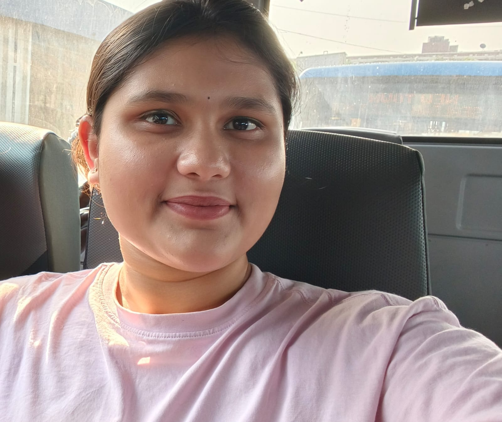

<!DOCTYPE html>
<html lang="en">
<head>
<meta charset="UTF-8">
<meta name="viewport" content="width=device-width, initial-scale=1.0">

<title>Happy Birthday ❤️</title>

</head>

<body>

<button class="musicBtn" onclick="toggleMusic()">
🎵 Music
</button>

<audio id="music" loop>
<source src="Github song final.mpeg" type="audio/mpeg">
</audio>

<!-- PAGE 1 -->

<section class="page active" id="page1">

<h1 class="title">
Happy Birthday 🎉
</h1>

<h2 class="friend" id="TRINISHA">
MAAAHHH BABBYY ❤️
</h2>

<button onclick="startBirthday()">
Start Celebration ✨
</button>

</section>

<!-- PAGE 2 -->

<section class="page" id="page2">

<h1>Make A Wish 🌟</h1>

Blow into your microphone 🎤

<button onclick="blowCandles()">
Blow Candles 🎂
</button>

</section>

<!-- PAGE 3 -->

<section class="page" id="page3">

<h1>MAAAHH CUTTIEPIEE 📸</h1>

 

<button onclick="showPage(4)">
Next ❤️
</button>

</section>

<!-- PAGE 4 -->

<section class="page" id="page4">

<h2 style="color:#ff4f8f">
Birthday Letter 💌
</h2>

 

Dear BABBYYY(HG)

Happy Birthday to the most special person from my childhood.
Growing up with you is one of the best part of my life From silly conversations to bestest teas and all the memories we made together Every moment still means a lot to me.
No matter how much we grow up or how busy life gets You will always be my most important person i never forget.
Thanks for being there for me and you are the one who supported me a lot, gave me emotional support when i need someone the most.
Am really lucky to have the bestest friend like you.
I just hope this year brings you success,happiness,peace and everything your heart wishes for cuz you truely deserve it all.
Enjoy your day fully,smile a lot(MY CUTTIE PIE)
And Yeah.... Don't forget to send me snaps and fitchecks ❤️ And once again HAPPIEST BIRTHDAY TO YOU.❤️

<button onclick="showPage(5)">
Final Surprise 🎁
</button>

</section>

<!-- PAGE 5 -->

<section class="page" id="page5">

<h2>
Forever Best Friends MAHHHH BABBYYY 💕
</h2>

This is your fully customizable page.

Add anything here:

✨ Fireworks

<!DOCTYPE html>
<html lang="en">
<head>
<meta charset="UTF-8">
<meta name="viewport" content="width=device-width, initial-scale=1.0">
<title>Promise Reveal</title>

</head>
<body>

<button onclick="revealPromise()">Reveal Promise 💖</button>

    No matter where life takes us, I promise to always cherish our friendship and support you through every chapter of life.

<canvas id="fireworks"></canvas>

✨ Future promises

<section id="future-promise">
    <h2>💖 Dear Best Friend,

We've known each other since childhood, and through all these years you've been one of the most important people in my life.
We've shared laughter, memories, silly moments, and countless stories that I'll always treasure.

On your special day, I want to make a simple promise to you.
I promise that no matter where life takes us, I'll always value our friendship.
I promise to support you in your dreams, celebrate your successes, and stand by you during difficult times.
Even if distance, busy schedules, or time try to get in the way, our friendship will always have a special place in my heart.

Thank you for being such an amazing friend and for making my childhood and life so much brighter.
I hope your future is filled with happiness, success, good health, and endless reasons to smile.

Happy Birthday, my bestest Friend.

With lots of love and respect,
Your Childhood Best Friend (SIR JII) ❤️</h2>

    

        

    

</section>

✨ Love and friendship quotes

    <h2>❤️ A Special Quote For Mahhh BABBY ❤️</h2>

    

    "I think my favorite notification is one from you. ✨"
    

    

        ✨ With lots of appreciation and best wishes ✨
    

<h2>✨ Anything You Want ✨</h2>
<section class="gifts">
    <h2>🎁 Choose Your Gift 🎁</h2>

    

        
        
        
        
    

</section>

</section>

</body>
</html># index....html
